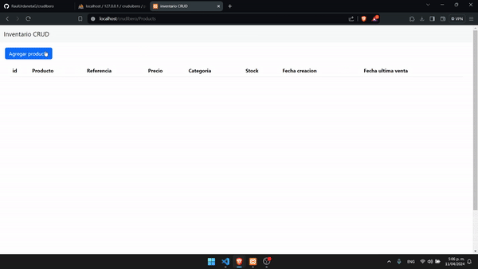

# Base de datos
* Para la base de datos sera necesario crear dicha base de datos en mysql con el nombre `cruduibero`, asegurandose que este hosteada en 127.0.0.1 en el puerto 3306
* Crear una tabla con el nombre `productos`
* Esta tabla tendrá como campos 
1. id:int auto incremento habilitado
2. Producto:varchar 
3. Referencia:int
4. Categoria:varchar
5. Stock:int
6. Creacion:date
7. UltimaVenta:datetime null habilitado

* En caso de que la base de datos tenga contraseña navegar a `Models/connection.php` y cambiar el valor de la variable `$pass` por la contraseña

# Compilar el programa
* Usar windows como sistema operativo
* Para la configuracion es necesario contar con xampp
* Buscar el directorio de xampp en el disco local y navegar a la carpeta publica de la aplicación la ruta será `C:\xampp\htdocs`
* Clonar el repositorio en esta carpeta usando  `git clone https://github.com/RaulUrdanetaG/crudIbero.git`
* Finalmente navegar a `http://localhost/crudIbero/Products`